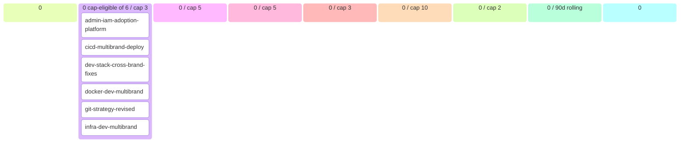

# Platform Backlog (auto-generated)

> Generated at: `2026-05-20T01:36:31+00:00`
> DO NOT EDIT MANUALLY — modify source artifacts.
> Regenerate: `python scripts/generate_backlog.py`

## 📊 Roadmap view (filtered + curated)

### 💡 Ideas (0)
- _(none)_

### 🔬 Refining (6 total · 0 cap-eligible / cap 3)
- **admin-iam-adoption-platform**
- **cicd-multibrand-deploy**
- **dev-stack-cross-brand-fixes**
- **docker-dev-multibrand**
- **git-strategy-revised**
- **infra-dev-multibrand**

### ✅ Refined — listo para arquitectos (0 / cap 5)
- _(none)_

### 📦 Ready for development (0 / cap 5)
- _(none)_

### 🔨 Developing (0 / cap 3)
- _(none)_

### 🧪 Developed — esperando QA (0 / cap 10)
- _(none)_

### 🔍 Reviewing (0 / cap 2)
- _(none in review)_

### Recently shipped (last 90d, 0 items)
- _(none recent)_

### Parked (0) · Dropped (0)

---

## 🔄 Operational view (Mermaid kanban)

---

## 📈 Capabilities snapshot

| module | live | in-progress | planned | deprecated | total |
|---|---|---|---|---|---|
| **TOTAL** | **0** | **0** | **0** | **0** | **0** |

